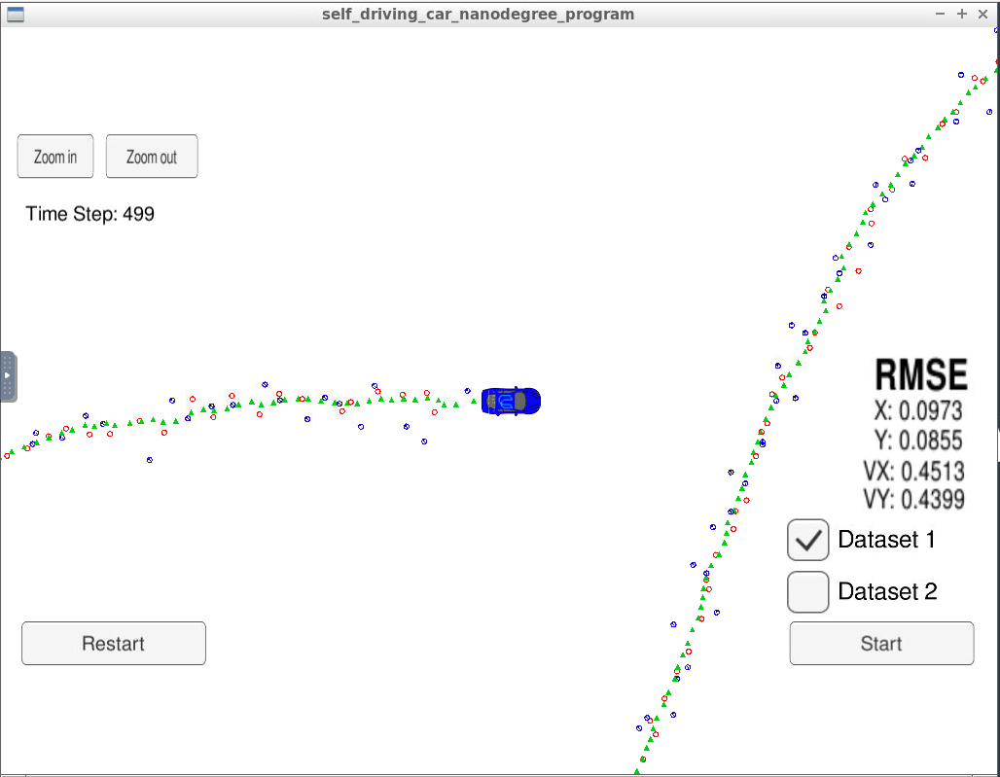
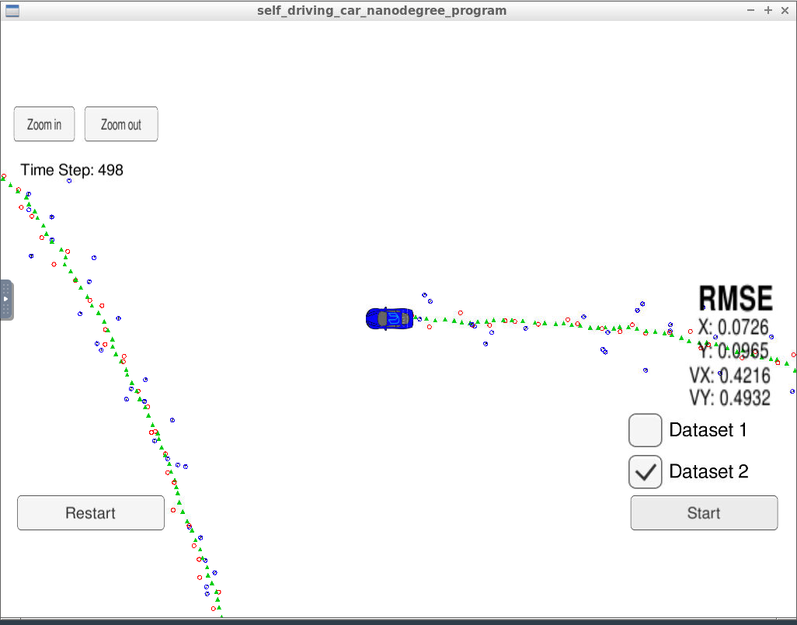

# Extended Kalman Filter Project
Self-Driving Car Engineer Nanodegree Program

In this project you will utilize a kalman filter to estimate the state of a moving object of interest with noisy lidar and radar measurements. Passing the project requires obtaining RMSE values that are lower than the tolerance outlined in the project rubric. 

This project involves the Term 2 Simulator which can be downloaded [here](https://github.com/udacity/self-driving-car-sim/releases).

## Files structure in Project
* Code in the src folder
* README file with instructions on compiling the code
* Docs folder, which contains details about the structure of the code templates
* CMakeLists.txt file that will be used when compiling your code (you do not need to change this file)
* data file for testing your extended Kalman filter which the simulator interface provides

This repository includes two files that can be used to set up and install [uWebSocketIO](https://github.com/uWebSockets/uWebSockets) for either Linux or Mac systems. For windows you can use either Docker, VMware, or even [Windows 10 Bash on Ubuntu](https://www.howtogeek.com/249966/how-to-install-and-use-the-linux-bash-shell-on-windows-10/) to install uWebSocketIO. Please see the uWebSocketIO Starter Guide page in the classroom within the EKF Project lesson for the required version and installation scripts.

## Dependency installtion
* Run ./install-ubuntu.sh in the terminal window to make sure the necessary dependencies are installed (you may need to run chmod u+x install-ubuntu.sh to make the file executable).

## Other Important Dependencies

* cmake >= 3.5
  * All OSes: [click here for installation instructions](https://cmake.org/install/)
* make >= 4.1 (Linux, Mac), 3.81 (Windows)
  * Linux: make is installed by default on most Linux distros
  * Mac: [install Xcode command line tools to get make](https://developer.apple.com/xcode/features/)
  * Windows: [Click here for installation instructions](http://gnuwin32.sourceforge.net/packages/make.htm)
* gcc/g++ >= 5.4
  * Linux: gcc / g++ is installed by default on most Linux distros
  * Mac: same deal as make - [install Xcode command line tools](https://developer.apple.com/xcode/features/)
  * Windows: recommend using [MinGW](http://www.mingw.org/)

## Basic Build Instructions

1. Clone this repo.
2. Make a build directory: `mkdir build && cd build`
3. Compile: `cmake .. && make` 
   * On windows, you may need to run: `cmake .. -G "Unix Makefiles" && make`
4. Run it: `./ExtendedKF `

## Code Style

Please (do your best to) stick to [Google's C++ style guide](https://google.github.io/styleguide/cppguide.html).


## Project Instructions and Rubric

Note: regardless of the changes you make, your project must be buildable using
cmake and make!

More information is only accessible by people who are already enrolled in Term 2 (three-term version) or Term 1 (two-term version)
of CarND. If you are enrolled, see the Project Resources page in the classroom
for instructions and the project rubric.

## Project Specification (Rubric Points)

### Compiling
* Criteria : Your code should compile.
   All code is compiling withouth errors and genrated ExtendedKF binary. 
* Build output
```
cmake .. && make
-- The C compiler identification is GNU 5.4.0
-- The CXX compiler identification is GNU 5.4.0
-- Check for working C compiler: /usr/bin/cc
-- Check for working C compiler: /usr/bin/cc -- works
-- Detecting C compiler ABI info
-- Detecting C compiler ABI info - done
-- Detecting C compile features
-- Detecting C compile features - done
-- Check for working CXX compiler: /usr/bin/c++
-- Check for working CXX compiler: /usr/bin/c++ -- works
-- Detecting CXX compiler ABI info
-- Detecting CXX compiler ABI info - done
-- Detecting CXX compile features
-- Detecting CXX compile features - done
-- Configuring done
-- Generating done
-- Build files have been written to: /home/workspace/CarND-Extended-Kalman-Filter-Project/build
Scanning dependencies of target ExtendedKF
[ 20%] Building CXX object CMakeFiles/ExtendedKF.dir/src/main.cpp.o
[ 40%] Building CXX object CMakeFiles/ExtendedKF.dir/src/tools.cpp.o
[ 60%] Building CXX object CMakeFiles/ExtendedKF.dir/src/FusionEKF.cpp.o
[ 80%] Building CXX object CMakeFiles/ExtendedKF.dir/src/kalman_filter.cpp.o
[100%] Linking CXX executable ExtendedKF
[100%] Built target ExtendedKF
```
### Accuracy
* Criteria : px, py, vx, vy output coordinates must have an RMSE <= [.11, .11, 0.52, 0.52] when using the file: "obj_pose-laser-radar-synthetic-input.txt" which is the same data file the simulator uses for Dataset 1.

The EKF accuracy was:

    * Dataset 1 : RMSE <= [0.0973, 0.0855, 0.4513, 0.4399]
    * Dataset 2 : RMSE <= [0.0726, 0.0965, 0.4216, 0.4932]




### Follows the Correct Algorithm
* Criteria : Your Sensor Fusion algorithm follows the general processing flow. 
  Sensor fusion algorithm implementation can be found src/kalman_filter.cpp and it is used to predict and to update at src/FusionEKF.cpp line 44 to 154 from both Lidar and Radar data.
  
* Criteria : Your Kalman Filter algorithm handles the first measurements appropriately.
  Kalaman filter algorithm handles first measurement approriately at line 48-90 in src/FusionEKF.cpp.
  
* Criteria : Your Kalman Filter algorithm first predicts then updates.
Kalaman filter algorithm handles first predict line 126 and then update at line 142(Radar) and 147(Lidar) in src/FusionEKF.cpp.

* Criteria : Your Kalman Filter can handle radar and lidar measurements.
Kalaman filter algorithm handles updates Radar and Lidar data differently at line 142(Radar) and 147(Lidar) in src/FusionEKF.cpp. The function Update() at line 37 scr/kalman_filter.cpp and UpdateEKF() at line 56 scr/kalman_filter.cpp handles Lidar and Radar data appropriately. 

### Code Efficiency

* Criteria : Your algorithm should avoid unnecessary calculations.
Implementation in scr/kalman_filter.cpp and src/FusionEKF.cpp does not have unnecessary calculations.

